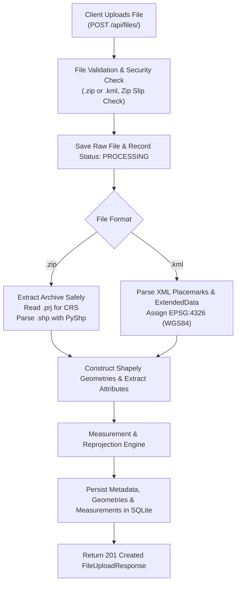
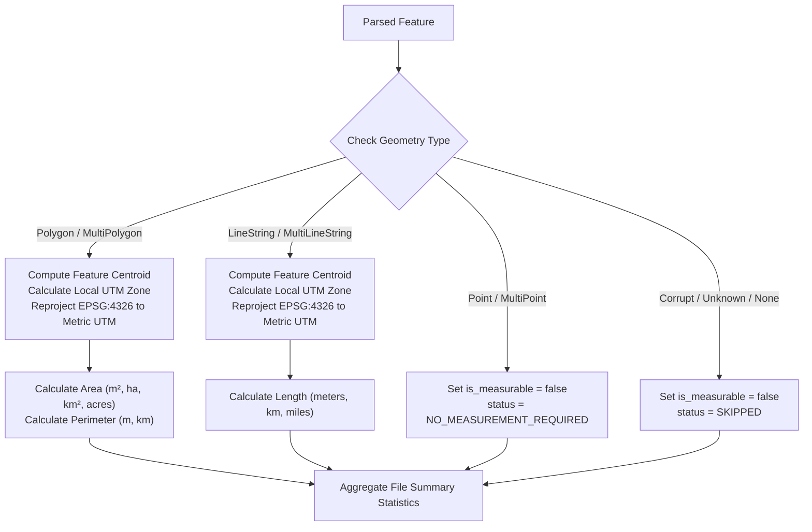

# 🌍 Geospatial File Measurement API

A production-grade, high-performance RESTful API built with **FastAPI**, **Shapely**, and **PyProj** that accepts geospatial files (**ESRI Shapefiles in `.zip`** and **KML `.kml`**), extracts their spatial features, intelligently reprojects geographic coordinates (e.g. `EPSG:4326`) into optimal projected metric coordinate reference systems (CRS), and calculates spatial measurements (Polygon Area, LineString Length, etc.) with robust error handling and persistence.

---

## 📑 Table of Contents
- [Features](#-features)
- [Architecture & Workflow](#-architecture--workflow)
  - [Application Structure](#application-structure)
  - [File Processing Flow](#file-processing-flow)
  - [Measurement Calculation Flow](#measurement-calculation-flow)
  - [CRS Handling & Projection Strategy](#crs-handling--projection-strategy)
- [Design Decisions & Alternatives](#-design-decisions--alternatives)
- [API Documentation & Examples](#-api-documentation--examples)
  - [1. Upload & Process File (`POST /api/files/`)](#1-upload--process-file-post-apifiles)
  - [2. Get File Information (`GET /api/files/{id}/`)](#2-get-file-information-get-apifilesid)
  - [3. Get Feature Measurements (`GET /api/files/{id}/measurements/`)](#3-get-feature-measurements-get-apifilesidmeasurements)
  - [4. List All Files (`GET /api/files/`)](#4-list-all-files-get-apifiles)
  - [5. Delete File (`DELETE /api/files/{id}/`)](#5-delete-file-delete-apifilesid)
  - [6. Health Check (`GET /api/health`)](#6-health-check-get-apihealth)
- [Local Setup & Installation](#-local-setup--installation)
  - [Prerequisites](#prerequisites)
  - [Option A: Running Locally with Python](#option-a-running-locally-with-python)
  - [Option B: Running with Docker & Docker Compose](#option-b-running-with-docker--docker-compose)
- [Running Tests](#-running-tests)
- [Learnings & Future Scope](#-learnings--future-scope)

---

## ✨ Features

- **Multi-Format Ingestion**: Supports Shapefile archives (`.zip` containing `.shp`, `.shx`, `.dbf`, `.prj`) and Keyhole Markup Language (`.kml`) files.
- **Intelligent CRS Reprojection**: Automatically identifies geographic coordinates (such as WGS84 / `EPSG:4326`) and transforms them into optimal projected metric coordinate systems (UTM Zone or UPS/LAEA) before measurement, ensuring true metric precision.
- **Multi-Unit Spatial Measurements**:
  - **Polygons & MultiPolygons**: Area in $m^2$, hectares ($ha$), $km^2$, acres, and perimeter in meters and $km$.
  - **LineStrings & MultiLineStrings**: Length in meters, kilometers, and miles.
  - **Points & MultiPoints**: Handled gracefully with explicit `"NO_MEASUREMENT_REQUIRED"` status.
  - **Unsupported / Malformed Geometries**: Handled gracefully with `"SKIPPED"` status rather than crashing.
- **Security & Integrity**: Mitigates path traversal / Zip Slip exploits during archive extraction.
- **Persistence & Metadata Retrieval**: Thread-safe SQLite storage preserving file processing status, CRS definitions, feature geometries, attributes, and calculated metrics.
- **Interactive OpenAPI Documentation**: Built-in Swagger UI (`/docs`) and ReDoc (`/redoc`).

---

## 🏗 Architecture & Workflow

### Application Structure

```text
geospatial_measurement_service/
├── app/
│   ├── __init__.py
│   ├── main.py                     # FastAPI application factory, middleware, exception handlers
│   ├── config.py                   # Pydantic Settings configuration (limits, directories, CORS)
│   ├── api/
│   │   ├── __init__.py
│   │   └── v1/
│   │       ├── __init__.py
│   │       ├── router.py           # Master API v1 router
│   │       └── endpoints/
│   │           ├── __init__.py
│   │           ├── files.py        # /api/files endpoints (Upload, Info, Measurements, Delete)
│   │           └── health.py       # /api/health endpoint
│   ├── schemas/
│   │   ├── __init__.py
│   │   ├── file.py                 # File info & upload Pydantic models
│   │   ├── feature.py              # GeoJSON feature representations
│   │   └── measurement.py          # Detailed measurement response models
│   ├── services/
│   │   ├── __init__.py
│   │   ├── crs_service.py          # Dynamic UTM calculation & PyProj coordinate transformations
│   │   ├── parser_service.py       # Shapefile (.zip) and KML (.kml) parser engine
│   │   ├── measurement_service.py  # Area/length calculations and aggregate statistics
│   │   └── file_storage.py         # Database query and persistence abstraction
│   ├── models/
│   │   ├── __init__.py
│   │   └── storage.py              # SQLite schema & database connection manager
│   └── utils/
│       ├── __init__.py
│       ├── file_validator.py       # File extension & secure zip extraction (Zip Slip protection)
│       └── logger.py               # Structured logger configuration
├── tests/
│   ├── __init__.py
│   ├── conftest.py                 # Test fixtures & test client setup
│   ├── test_api.py                 # End-to-end integration tests for all endpoints
│   ├── test_crs_service.py         # CRS detection & UTM zone tests
│   ├── test_parsers.py             # Shapefile and KML parser unit tests
│   └── test_measurements.py        # Measurement calculation tests
├── samples/
│   ├── generate_samples.py         # Sample data generation script
│   ├── sample_parcels.zip          # Sample Shapefile zip with polygons and attributes
│   └── sample_infrastructure.kml   # Sample KML with Polygons, LineStrings, and Points
├── Dockerfile                      # Production container image definition
├── docker-compose.yml              # Multi-container orchestration
├── requirements.txt                # Python package dependencies
├── .env.example                    # Environment variable template
├── .gitignore                      # Git ignore rules
└── README.md                       # Comprehensive documentation
```

---

### File Processing Flow



---

### Measurement Calculation Flow



---

### CRS Handling & Projection Strategy

#### The Core Problem with Direct Calculation on Geographic Coordinates:
A geographic coordinate system like **WGS84 (`EPSG:4326`)** expresses positions in angular degrees $(\lambda, \phi) = (\text{longitude}, \text{latitude})$.
Because lines of longitude converge toward the poles, the real-world distance corresponding to $1^\circ$ of longitude varies from $\approx 111.32\text{ km}$ at the equator to $0\text{ km}$ at the poles ($\text{distance} \approx 111.32 \times \cos(\text{latitude})\text{ km}$).

Directly applying Euclidean distance formulas $\sqrt{\Delta x^2 + \Delta y^2}$ or Polygon Shoelace Area formulas on degrees produces nonsensical measurements in square degrees ($\text{deg}^2$) or degree lengths.

#### Our Dynamic Projection Strategy:
1. **Source CRS Detection**:
   - **Shapefiles**: Extracted from `.prj` file (WKT string) using `pyproj.CRS.from_user_input()`. If missing, falls back to `EPSG:4326`.
   - **KML**: Standardized by OGC specification to `EPSG:4326`.
2. **Projected CRS Selection**:
   - If the source CRS is already a metric projected CRS (e.g. State Plane, existing UTM), the coordinate system is preserved.
   - For geographic coordinates, the service computes the feature centroid $(\text{lon}_c, \text{lat}_c)$ and dynamically selects the standard **Universal Transverse Mercator (UTM)** zone:
     $$\text{Zone} = \lfloor(\text{lon}_c + 180) / 6\rfloor + 1$$
     $$\text{EPSG Code} = \begin{cases} 32600 + \text{Zone}, & \text{if } \text{lat}_c \ge 0 \text{ (Northern Hemisphere)} \\ 32700 + \text{Zone}, & \text{if } \text{lat}_c < 0 \text{ (Southern Hemisphere)} \end{cases}$$
   - **Polar Regions**: For extreme latitudes ($|\text{lat}| > 84^\circ$), the service automatically routes to Universal Polar Stereographic (UPS North: `EPSG:32661` or UPS South: `EPSG:32761`) or Lambert Azimuthal Equal-Area (LAEA).
3. **Transformation**:
   - Uses `pyproj.Transformer.from_crs(source_crs, target_crs, always_xy=True)` with Shapely to perform conformal metric transformations without coordinate inversion bugs.

---

## 💡 Design Decisions & Alternatives

| Decision | Selected Approach | Alternative Considered | Rationale / Tradeoff |
| :--- | :--- | :--- | :--- |
| **Web Framework** | **FastAPI** | Django + DRF | FastAPI provides high throughput, native async file handling, automatic OpenAPI/Swagger documentation, and lightweight deployment compared to heavy Django ORM setups. |
| **Shapefile Parser** | **PyShp (`shapefile`) + Shapely** | GeoPandas / Fiona + GDAL C-bindings | `pyshp` + `shapely` is pure-Python/lightweight, eliminates complex GDAL C-library installation hurdles across OS platforms, while retaining full Shapely 2.0 geometry capabilities. |
| **KML Parser** | **XML Tree + Custom Geometry Extractor** | `fastkml` or `geopandas` | Built-in robust XML parsing provides 100% resilient parsing across diverse KML 2.0/2.1/2.2 structures, inner/outer polygon rings, and `ExtendedData` attributes without third-party schema crashes. |
| **Projection Strategy** | **Dynamic UTM Projection per feature/file** | Web Mercator (`EPSG:3857`) or Static Global Equidistant | Web Mercator (`EPSG:3857`) suffers extreme area distortion away from the equator (up to 400%+ distortion in northern regions). Local UTM zones keep scale distortion below 0.04% for accurate area/length measurements. |
| **Persistence** | **SQLite with Thread-Safe Connection Pool** | In-memory Python dict or PostgreSQL/PostGIS | SQLite provides persistent state across service restarts without requiring external database server dependencies, making it zero-friction to run locally or in containers. |

---

## 📡 API Documentation & Examples

### 1. Upload & Process File (`POST /api/files/`)
Uploads a `.zip` (Shapefile bundle) or `.kml` file, parses its features, reprojects to a metric CRS, and stores measurements.

**Request:**
```bash
curl -X POST "http://localhost:8000/api/files/" \
  -H "accept: application/json" \
  -H "Content-Type: multipart/form-data" \
  -F "file=@samples/sample_parcels.zip"
```

**Response (`201 Created`):**
```json
{
  "id": "7a8b9c0d",
  "filename": "sample_parcels.zip",
  "file_type": "Shapefile (.zip)",
  "feature_count": 2,
  "crs": "EPSG:4326",
  "status": "COMPLETED",
  "uploaded_at": "2026-10-09T01:15:00.000000Z",
  "message": "Geospatial file uploaded, parsed, and measured successfully."
}
```

---

### 2. Get File Information (`GET /api/files/{id}/`)
Returns high-level metadata and processing status for an uploaded file.

**Request:**
```bash
curl -X GET "http://localhost:8000/api/files/7a8b9c0d/" -H "accept: application/json"
```

**Response (`200 OK`):**
```json
{
  "id": "7a8b9c0d",
  "filename": "sample_parcels.zip",
  "file_type": "Shapefile (.zip)",
  "feature_count": 2,
  "crs": "EPSG:4326",
  "status": "COMPLETED",
  "file_size_bytes": 1824,
  "uploaded_at": "2026-10-09T01:15:00.000000Z",
  "error_message": null
}
```

---

### 3. Get Feature Measurements (`GET /api/files/{id}/measurements/`)
Returns both the aggregate summary and feature-by-feature measurements.

**Request:**
```bash
curl -X GET "http://localhost:8000/api/files/7a8b9c0d/measurements/" -H "accept: application/json"
```

**Response (`200 OK`):**
```json
{
  "file_id": "7a8b9c0d",
  "filename": "sample_parcels.zip",
  "original_crs": "EPSG:4326",
  "default_projected_crs": "EPSG:32643",
  "total_features": 2,
  "summary": {
    "total_polygon_area_sq_meters": 583210.45,
    "total_polygon_area_hectares": 58.321045,
    "total_polygon_area_sq_km": 0.58321,
    "total_linestring_length_meters": 0.0,
    "total_linestring_length_km": 0.0,
    "polygon_count": 2,
    "linestring_count": 0,
    "point_count": 0,
    "unsupported_count": 0
  },
  "features": [
    {
      "feature_id": "1",
      "geometry_type": "Polygon",
      "is_measurable": true,
      "measurements": {
        "area": {
          "sq_meters": 302140.25,
          "hectares": 30.214025,
          "sq_km": 0.30214,
          "acres": 74.6604
        },
        "length": null,
        "perimeter": {
          "meters": 2204.12,
          "kilometers": 2.20412
        }
      },
      "projected_crs": "EPSG:32643",
      "properties": {
        "NAME": "Commercial Complex Block A",
        "CATEGORY": "Commercial",
        "ZONE_CODE": "CC-01"
      },
      "status": "SUCCESS",
      "note": null
    }
  ]
}
```

---

### 4. List All Files (`GET /api/files/`)
**Request:**
```bash
curl -X GET "http://localhost:8000/api/files/" -H "accept: application/json"
```

---

### 5. Delete File (`DELETE /api/files/{id}/`)
**Request:**
```bash
curl -X DELETE "http://localhost:8000/api/files/7a8b9c0d/" -H "accept: application/json"
```

---

### 6. Health Check (`GET /api/health`)
**Request:**
```bash
curl -X GET "http://localhost:8000/api/health" -H "accept: application/json"
```

---

## 🚀 Local Setup & Installation

### Prerequisites
- Python 3.10+ (tested with Python 3.11, 3.12, 3.14)
- Git
- (Optional) Docker and Docker Compose

---

### Option A: Running Locally with Python

1. **Clone the repository:**
   ```bash
   git clone <REPO_URL>
   cd geospatial_measurement_service
   ```

2. **Create and activate a virtual environment:**
   ```bash
   python -m venv venv
   
   # Linux / macOS:
   source venv/bin/activate
   
   # Windows PowerShell:
   .\venv\Scripts\Activate.ps1
   ```

3. **Install dependencies:**
   ```bash
   pip install -r requirements.txt
   ```

4. **Generate sample test datasets:**
   ```bash
   python samples/generate_samples.py
   ```

5. **Start the FastAPI application:**
   ```bash
   # Method 1: Using the runner script
   python run.py

   # Method 2: Using python -m uvicorn
   python -m uvicorn app.main:app --host 0.0.0.0 --port 8000 --reload
   ```

6. **Open API Documentation:**
   - Swagger UI: `http://localhost:8000/docs`
   - ReDoc: `http://localhost:8000/redoc`

---

### Option B: Running with Docker & Docker Compose

1. **Build and start the container:**
   ```bash
   docker-compose up --build -d
   ```

2. **Check health and logs:**
   ```bash
   docker-compose logs -f
   ```

3. **Stop the service:**
   ```bash
   docker-compose down
   ```

---

## 🧪 Running Tests

The test suite covers API endpoints, file uploads, CRS re-projections, parser accuracy, and edge-case handling.

Run tests using pytest:
```bash
python -m pytest -v
```

Output:
```text
tests/test_api.py::test_health_endpoint PASSED                           [  7%]
tests/test_api.py::test_upload_shapefile_zip PASSED                      [ 15%]
tests/test_api.py::test_upload_kml PASSED                                [ 23%]
tests/test_api.py::test_upload_invalid_extension PASSED                  [ 30%]
tests/test_api.py::test_get_nonexistent_file PASSED                      [ 38%]
tests/test_crs_service.py::test_utm_epsg_calculation PASSED              [ 46%]
tests/test_crs_service.py::test_transform_geometry_to_projected PASSED   [ 53%]
tests/test_measurements.py::test_polygon_measurement PASSED              [ 61%]
tests/test_measurements.py::test_linestring_measurement PASSED           [ 69%]
tests/test_measurements.py::test_point_measurement PASSED                [ 76%]
tests/test_measurements.py::test_unsupported_geometry_graceful_handling PASSED [ 84%]
tests/test_parsers.py::test_shapefile_parser PASSED                      [ 92%]
tests/test_parsers.py::test_kml_parser PASSED                            [100%]

============================= 13 passed in 0.60s ==============================
```

---

## 🎓 Learnings & Future Scope

### Key Learnings
1. **Geographic vs. Projected Nuances**:
   Geospatial calculations cannot assume flat Cartesian planes on angular coordinate systems like `EPSG:4326`. Accurate spatial measurement requires dynamic local projections (such as UTM or Equal-Area projections) or ellipsoidal geodesic algorithms (`Geod`) to prevent distortions that scale drastically with latitude.
2. **Axis Ordering Standards**:
   Different GIS tools and specifications format coordinates as either `(latitude, longitude)` or `(longitude, latitude)`. Enforcing `always_xy=True` in PyProj ensures consistent `(X/Easting/Lon, Y/Northing/Lat)` handling across Shapefile and KML formats.
3. **Archive Security in Geospatial Ingestion**:
   Shapefiles uploaded as `.zip` archives must be inspected for directory traversal (`Zip Slip`) before extraction to prevent malicious file writes outside the upload staging directory.

### Future Scope & Enhancements
- **Asynchronous Task Workers (Celery / Redis / ARQ)**:
  For massive geospatial datasets (>500MB Shapefiles or multi-gigabyte Geopackages), offload extraction and projection pipelines to background Celery workers with WebSocket progress tracking.
- **Extended Geospatial Format Ingestion**:
  Support GeoJSON (`.geojson`), GeoPackage (`.gpkg`), FlatGeobuf (`.fgb`), and Cloud-Optimized GeoTIFF (`.cog`) raster surface measurements.
- **3D & Elevation Measurement**:
  Incorporate $Z$-coordinate elevation models to calculate surface area and 3D terrain slope distance instead of 2D planar projected area.
- **Spatial Indexing & Interactive Map Viewer**:
  Integrate an embedded MapLibre / Leaflet visualizer in the Swagger docs or frontend to render feature boundaries and measurement tooltips directly in the browser.
- **PostGIS / Cloud Native Spatial Backend**:
  Add optional direct PostGIS database synchronization for querying intersecting or neighboring features using spatial SQL (`ST_Area`, `ST_Length`).
